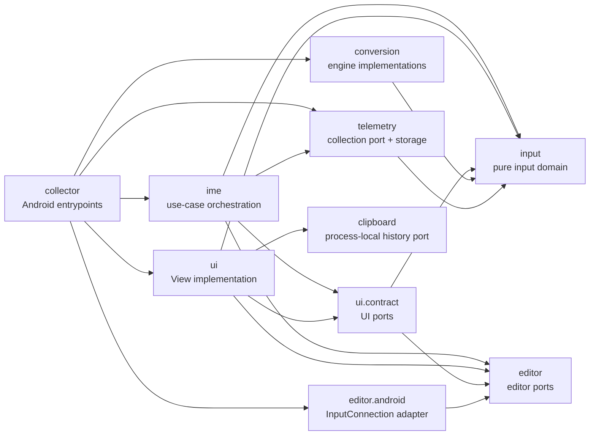

# Package architecture

The IME uses package boundaries as dependency boundaries, not only as folders.

## Responsibilities and boundary ports

| Package | Responsibility | Boundary exposed to consumers |
| --- | --- | --- |
| `collector` | Android lifecycle and dependency assembly | Android components only |
| `input` | Pure composition state and text-input rules | `ConversionEngine` |
| `editor` | Platform-independent editor operation contracts | `CompositionEditor`, `EditorTextMutations`, `EditorTextQueries`, `EditorNavigation` |
| `editor.android` | Fallible `InputConnection` calls | Implements the four editor ports |
| `conversion` | Mozc and fallback engine implementations | Implements `ConversionEngine` |
| `ime` | Orders one editor-session use case | Implements UI action/state ports |
| `ui.contract` | Read state and emit user intent without View dependencies | Small state/action interfaces |
| `ui` | Keyboard views and transient presentation state | `KeyboardUiController`, `CompositionPresentation` |
| `telemetry` | Consent, privacy filtering, event creation, encryption and storage | `ImeTelemetry` |
| `clipboard` | Process-scoped, cross-target-app clipboard history | `ClipboardHistory` |

`input`, `editor`, and `clipboard` do not depend on another project package. Concrete adapters are
constructed only in `CollectorImeService`. `PackageDependencyTest` enforces the allowed import
directions so an implementation dependency cannot silently cross a boundary later.
